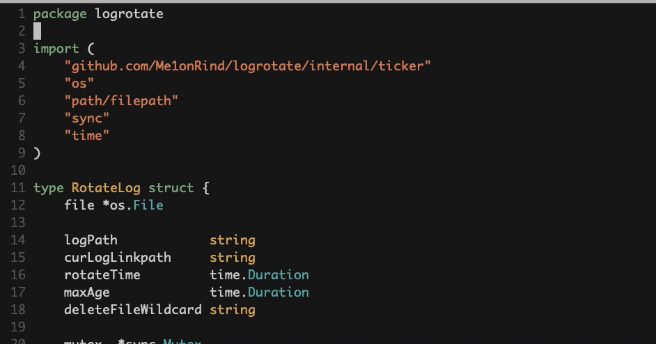

# gomodule-info

Provides a function to get the Go Module info. 

You can configure shortcuts to insert import path prefix quickly.



## install

[vim-plug](https://github.com/junegunn/vim-plug)

```vim
Plug 'Me1onRind/gomodule-info'
```

## Provider function

### GoModuleName()

Retrun current editing file's go module name. It will lookup parent directory until find out go.mod or arrive root directory.

## configure

### edit your .vimrc

```vim
function InsertGomoduleImportItem()
    let str = "\t\"" . GoModuleName() ."/\""
    call append(line('.'), l:str)
    normal j$
    startinsert
endfunction

nmap gii :call InsertGomoduleImportItem()<CR>
```

You can do change detail according to persion preference or do something else.
